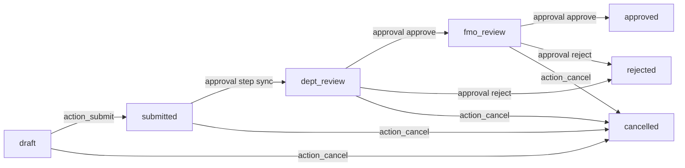
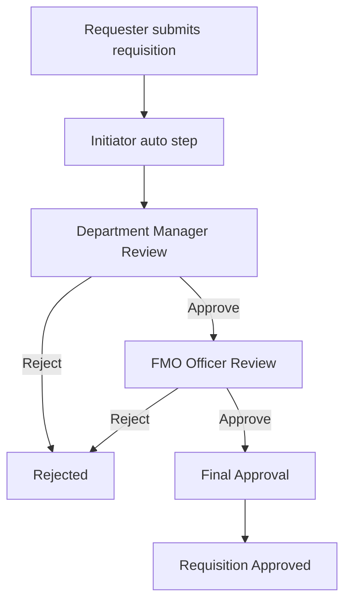
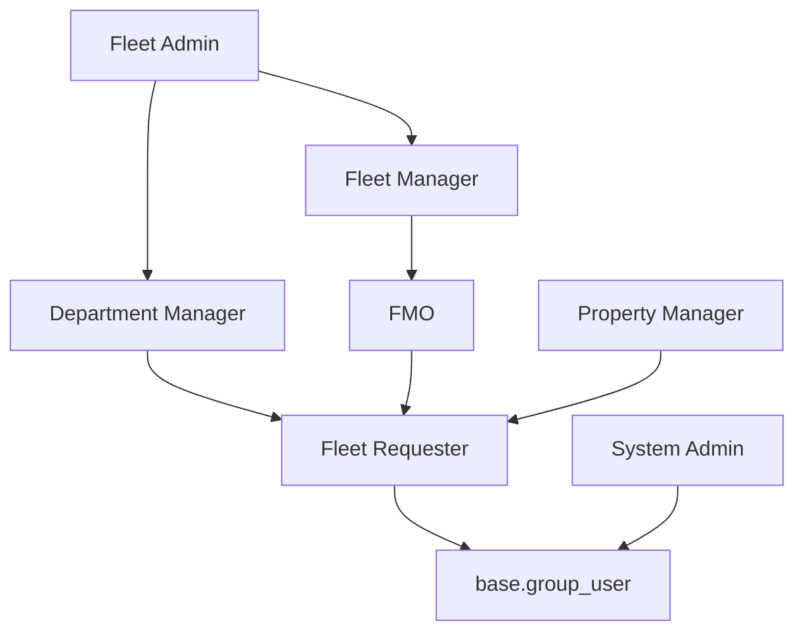
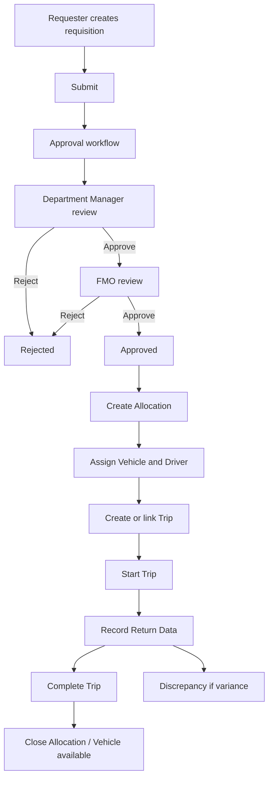

# Hagbes Fleet Management Audit Report

Audit date: 2026-05-07  
Module path: `odoo-dev/custom_addons/hagbes_fleet`  
Scope: all files under the module were reviewed recursively, including Python models, wizards, XML views, security, data, reports, tests, hooks, and static assets.

## 1. Module Overview

### Purpose

`hagbes_fleet` implements a custom fleet operations layer for Odoo 18. It covers:

- Vehicle master data and operational availability.
- Vehicle requisitions with multi-step approval integration.
- Assignments, maintenance, disposal approvals, and force-bypass actions.
- Trips, trip return recording, GPS/odometer/fuel fields, discrepancy tracking, allocations, append requests, and daily vehicle checkups.
- PDF reports for requisitions and trip summaries.

### Manifest Analysis

| Item | Value | Reference |
|---|---:|---|
| Name | Hagbes Fleet Management | `__manifest__.py:2` |
| Version | `18.0.1.1.0` | `__manifest__.py:3` |
| Category | Fleet | `__manifest__.py:4` |
| Summary | Vehicle fleet management with assignment and maintenance tracking | `__manifest__.py:5` |
| Installable | True | `__manifest__.py:42` |
| Application | True | `__manifest__.py:43` |

### Installed Dependencies

Declared dependencies: `base`, `fleet`, `hr`, `mail`, `sms`, `hagbes_approval_workflow` (`__manifest__.py:6-13`).

Observations:

- `hagbes_approval_workflow` is a hard dependency, so the module is not actually standalone despite code comments mentioning standalone behavior.
- `product.product` is referenced by maintenance (`models/fleet_maintenance.py:22`) but `product` is not declared directly. This may be satisfied transitively by `fleet`, but a direct dependency is safer.
- `sms` is declared but no SMS code, templates, or notifications are implemented.
- Static CSS exists but no `assets` manifest key loads it (`static/src/css/fleet_layout_fix.css:1-17`).
- `hooks.py` defines `post_init_hook`, but the manifest does not register it. Because approval workflow is already a dependency, the hook is also logically redundant.

## 2. Technical Architecture

### File Structure

| Area | Files | Purpose |
|---|---|---|
| Models | `models/*.py` | Fleet business objects, approval integration, reports, HR extension |
| Wizards | `wizard/*.py`, `wizard/*.xml` | Trip actual-data entry and daily checkup modal |
| Security | `security/*.xml`, `security/ir.model.access.csv` | Groups, ACLs, record rules, core fleet menu hiding |
| Data | `data/*.xml` | Sequences and approval flow definitions |
| Views | `views/*.xml` | Forms, lists, search views, kanban, menus, settings |
| Reports | `reports/*.xml`, `models/fleet_reports.py` | QWeb PDFs and report access guard |
| Tests | `tests/*.py` | Transaction tests for approval, discrepancies, logs, append requests |
| Static | `static/src/css/fleet_layout_fix.css` | Unloaded CSS layout overrides |
| Hooks | `hooks.py` | Unregistered post-init hook |

### Controllers, Services, Mixins

| Type | Implemented? | Notes |
|---|---|---|
| Controllers | No | No `controllers/` directory exists. |
| Services | No | Business logic is embedded in models. |
| Wizards | Yes | `fleet.trip.actual.wizard`, `fleet.checkup.wizard`, `fleet.checkup.wizard.line`. |
| Mixins | Yes | `approval.integration.mixin` centralizes approval trigger and callbacks. |
| Abstract reports | Yes | Two secure report models are defined in `models/fleet_reports.py`. |

### Inheritance Usage

| Model | Type | Inherits |
|---|---|---|
| `fleet.requisition` | Custom model | `mail.thread`, `mail.activity.mixin`, `approval.integration.mixin` |
| `hagbes.fleet.vehicle` | Custom model | `mail.thread`, `mail.activity.mixin`, `approval.integration.mixin` |
| `hagbes.fleet.vehicle.assign` | Custom model | `mail.thread`, `mail.activity.mixin`, `approval.integration.mixin` |
| `hagbes.fleet.maintenance` | Custom model | `mail.thread`, `mail.activity.mixin`, `approval.integration.mixin` |
| `fleet.trip` | Custom model | `mail.thread`, `mail.activity.mixin` |
| `hagbes.fleet.discrepancy` | Custom model | `mail.thread`, `mail.activity.mixin` |
| `approval.request` | Inherited external model | Adds requisition-state sync on step change |
| `hr.employee` | Inherited Odoo model | Adds driver/license fields |
| `res.config.settings` | Inherited Odoo model | Adds approval settings |

## 3. Models Analysis

### Model Inventory

| Model | Table | Description | Key References |
|---|---|---|---|
| `fleet.requisition` | `fleet_requisition` | Vehicle requisition form and approval-backed request workflow | `models/fleet_requisition.py:10-437` |
| `hagbes.fleet.vehicle` | `hagbes_fleet_vehicle` | Vehicle registry and computed status | `models/fleet_vehicle.py:8-141` |
| `hagbes.fleet.vehicle.assign` | `hagbes_fleet_vehicle_assign` | Vehicle-to-employee assignment | `models/fleet_vehicle_assign.py:8-115` |
| `hagbes.fleet.maintenance` | `hagbes_fleet_maintenance` | Maintenance/service records | `models/fleet_maintenance.py:8-96` |
| `fleet.trip` | `fleet_trip` | Trip execution, return data, GPS summaries, discrepancy flags | `models/fleet_trip.py:10-366` |
| `hagbes.fleet.allocation` | `hagbes_fleet_allocation` | Allocation of approved requisition to vehicle/driver | `models/fleet_allocation.py:7-254` |
| `hagbes.fleet.trip.log` | `hagbes_fleet_trip_log` | Allocation trip logs | `models/fleet_trip_log.py:7-100` |
| `hagbes.fleet.trip.gps` | `hagbes_fleet_trip_gps` | GPS point records | `models/fleet_trip_gps.py:7-53` |
| `hagbes.fleet.discrepancy` | `hagbes_fleet_discrepancy` | Expected-vs-actual discrepancy records | `models/fleet_discrepancy.py:7-131` |
| `hagbes.fleet.vehicle.status.log` | `hagbes_fleet_vehicle_status_log` | Daily vehicle status snapshots | `models/fleet_vehicle_status_log.py:8-95` |
| `hagbes.fleet.allocation.append` | `hagbes_fleet_allocation_append` | Extension of an allocation with additional destination/distance | `models/fleet_allocation_append.py:7-118` |
| `fleet.vehicle.history` | `fleet_vehicle_history` | Daily checkup history | `models/fleet_vehicle_history.py:5-25` |
| `fleet.trip.actual.wizard` | transient | Trip completion wizard | `wizard/fleet_trip_actual_wizard.py:5-50` |
| `fleet.checkup.wizard` | transient | Daily checkup wizard | `wizard/fleet_checkup_wizard.py:5-55` |
| `fleet.checkup.wizard.line` | transient | Daily checkup line | `wizard/fleet_checkup_wizard.py:57-72` |
| `approval.integration.mixin` | abstract | Approval helper | `models/approval_integration_mixin.py:6-207` |

### Field and Logic Summary

| Model | Important Fields | Computed / Related Fields | Constraints / Methods |
|---|---|---|---|
| `fleet.requisition` | `name`, `date_from`, `date_to`, `purpose`, `traveller_count`, `traveller`, `traveller_names`, `destination`, `request_by`, `department_id`, `state`, `vehicle_id`, approval metadata | `can_edit_requester`, `vehicle_plate_number`, `vehicle_driver_name` | Date validation, duplicate check, traveller validation, create/write/unlink overrides, approval callbacks, submit/cancel/complete |
| `hagbes.fleet.vehicle` | identification, fuel type, acquisition, driver, GPS flag, vehicle type, disposal state | `status`, custom display name | SQL unique plate/engine/chassis, disposal approval methods |
| `hagbes.fleet.vehicle.assign` | vehicle, employee, dates, state, notes | inherited approval helper flag | Date range and overlap constraint, submit/complete/reject/force activate |
| `hagbes.fleet.maintenance` | vehicle, type, date, cost, spare part, state | inherited approval helper flag | Threshold approval logic, submit/complete/reject/force activate |
| `fleet.trip` | vehicle, route, fuel, return data, GPS summary, discrepancy status, combined trip text | requisition count, related driver/plate, fuel estimate, actual distance, odometer gap, distance variance | Sequence create, odometer order, start/complete/cancel/view requisitions |
| `hagbes.fleet.allocation` | request, vehicle, driver, odometer, distance, fuel, allocation/return date, state | none | Return date validation, unique active allocation, create chatter, state-transition chatter |
| `hagbes.fleet.trip.log` | allocation, odometers, fuel, timestamps, GPS text | `actual_distance` | Odometer and time ordering |
| `hagbes.fleet.trip.gps` | trip, latitude, longitude, timestamp | none | Latitude/longitude range validation |
| `hagbes.fleet.discrepancy` | request/allocation, type, expected, actual, severity | `name`, `variance_percent` | Requires linked request or allocation, posts chatter notes |
| `hagbes.fleet.vehicle.status.log` | vehicle, odometer, fuel, condition, date | `display_name` | One log per vehicle per date, posts vehicle chatter |
| `hagbes.fleet.allocation.append` | allocation, destination, distance, reason, company | custom `name_get` | Positive distance, allocation chatter notes |
| `fleet.vehicle.history` | vehicle, check date, driver status, vehicle status, checked by, notes | none | none |
| `hr.employee` extension | `is_driver`, `license_number`, `license_expiry` | none | Driver license expiry cannot be in past |

### SQL Constraints

| Model | Constraint | Reference |
|---|---|---|
| `hagbes.fleet.vehicle` | Unique `plate_number`, `engine_number`, `chassis_number` | `models/fleet_vehicle.py:14-18` |
| `hagbes.fleet.vehicle.assign` | Placeholder `CHECK(1=1)` named `no_overlap` | `models/fleet_vehicle_assign.py:28-30` |
| `hagbes.fleet.allocation` | Empty list; relies on Python | `models/fleet_allocation.py:117-119` |

### Onchange Methods

| Model | Method | Behavior |
|---|---|---|
| `fleet.requisition` | `_onchange_request_by_department` | Syncs department from selected requester. |
| `fleet.trip.actual.wizard` | `_onchange_trip_id` | Defaults actual start place and start odometer from trip. |

### Business Logic Methods

Key business methods include approval triggering (`approval.integration.mixin:_trigger_approval`), requisition submission/cancellation/completion, vehicle disposal request/force disposal, assignment and maintenance submit/complete/reject/force activate, trip start/return/complete/cancel, allocation return/reset, discrepancy chatter creation, status-log chatter, and daily checkup history generation.

## 4. Workflow Analysis

### Requisition Workflow

Implemented states: `draft`, `submitted`, `dept_review`, `fmo_review`, `approved`, `rejected`, `cancelled` (`models/fleet_requisition.py:168-183`).



Important notes:

- Submission calls `_trigger_approval()` and posts chatter (`models/fleet_requisition.py:380-392`).
- Requisition state sync is performed by an `approval.request.write()` override when `current_step_id` changes (`models/approval_integration.py:6-31`).
- Full approval calls `_on_approval_approved()` and sets `state = approved` (`models/fleet_requisition.py:353-359`).
- Rejection calls `_on_approval_rejected()` and sets `state = rejected` (`models/fleet_requisition.py:361-364`).
- There is no functional implementation that allocates a requisition and sets `state = allocated`.
- `action_complete()` expects `state = allocated` and writes `completed`, but neither state exists in the selection. This is a critical workflow defect (`models/fleet_requisition.py:400-407`).

### Approval Flow Diagram



Approval XML defines:

- Fleet Assignment: initiator -> Property Manager/Fleet Manager Review -> final (`data/fleet_approval_flows.xml:3-47`).
- Fleet Maintenance: initiator -> Property Manager/Fleet Manager Review -> final (`data/fleet_approval_flows.xml:48-91`).
- Fleet Disposal: initiator -> Property Manager/Fleet Manager Review -> final (`data/fleet_approval_flows.xml:93-136`).
- Fleet Requisition: initiator -> Department Manager -> FMO Officer -> final (`data/fleet_approval_flows.xml:139-202`).

### Other Workflows

| Workflow | States | Buttons / Actions |
|---|---|---|
| Vehicle disposal | `disposal_state`: `none`, `waiting_approval`, `out_of_service`; computed vehicle `status` mirrors it | `action_request_disposal`, `action_force_disposal` |
| Vehicle assignment | `draft`, `pending`, `active`, `completed`, `rejected` | `action_submit`, `action_complete`, `action_force_activate`; unused `action_approve`, `action_reject` exist |
| Maintenance | `draft`, `pending`, `active`, `completed`, `rejected` | `action_submit`, `action_complete`, `action_force_activate`; unused `action_approve`, `action_reject` exist |
| Trip | `planning`, `in_progress`, `completed`, `cancelled` | Start trip, record return data, cancel trip |
| Allocation | `assigned`, `returned` | Return vehicle, reset to assigned |

## 5. UI / Views Analysis

### Views and Actions

| Model | Views | Action | Menu Exposure |
|---|---|---|---|
| `fleet.requisition` | Form, list, kanban, search | `action_fleet_requisition`; approval inbox action | Menu: Requisitions, Approvals |
| `hagbes.fleet.vehicle` | List, form | `action_fleet_vehicle` | Menu: Vehicles |
| `fleet.trip` | List, form | `action_fleet_trip` | Menu: Trips |
| `hagbes.fleet.allocation` | List, form, search | `action_fleet_allocation` | Menu: Allocations |
| `hagbes.fleet.discrepancy` | List, form, search | `action_fleet_discrepancy` | Menu: Discrepancies |
| `hagbes.fleet.vehicle.assign` | List, form | `action_fleet_assignment` | No menu item |
| `hagbes.fleet.maintenance` | List, form | `action_fleet_maintenance` | No menu item |
| `hagbes.fleet.trip.log` | List, form, search | `action_fleet_trip_log` | No menu item |
| `hagbes.fleet.trip.gps` | List, form, search | `action_fleet_trip_gps` | No menu item |
| `hagbes.fleet.vehicle.status.log` | List, form, search | `action_fleet_vehicle_status_log` | No menu item |
| `hagbes.fleet.allocation.append` | List, form, search | `action_fleet_allocation_append` | No menu item |
| `res.config.settings` | Inherited settings view | Settings app block | Configuration menu exists but no settings menu action |
| `hr.employee` | Inherited form/search | None | Existing HR menus only |

### Smart Buttons

Only `fleet.trip` implements a smart button to view linked requisitions (`views/fleet_trip_views.xml:15-18`, `models/fleet_trip.py:357-366`).

### Dashboard Views

There is no real dashboard model/view or client action. The requisition kanban is described as dashboard-style (`views/fleet_requisition_views.xml:116-170`) but does not provide dashboard metrics.

### Menu Structure Map

```text
Fleet
|-- Vehicles
|-- Allocations
|-- Trips
|-- Discrepancies
|-- Requisitions
|-- Approvals
|-- Reports
|-- Operations
|   `-- Daily Vehicle Checkup
`-- Configuration
```

Unexposed actions: assignments, maintenance, trip logs, GPS points, vehicle status logs, allocation append requests, report-specific menu entries, and fleet settings.

## 6. Security Analysis

### Groups and Role Hierarchy



Defined groups are Requester, Department Manager, FMO, Fleet Manager, Property Manager, and Fleet Admin (`security/groups.xml:16-62`).

### Access Rights Summary

| Area | Requester | Dept Manager | FMO | Property Manager | Fleet Manager | Fleet Admin |
|---|---|---|---|---|---|---|
| Vehicles | read/create, no write | read | read/write/create | read | inherited FMO | full |
| Requisitions | read/create, no write | read/write | full | read | full | full |
| Trips | read | read | full | read | inherited FMO | full |
| Assignments | read/create, no write | read/write | read/write/create | read | inherited FMO | full |
| Maintenance | read/create, no write | read/write | read/write/create | read | inherited FMO | full |
| Allocation/log/discrepancy/status append | mostly FMO/Admin write/create; Property read | partial | operational write | read | inherited FMO | full |

### Record Rules

Implemented record rules include:

- Multi-company restrictions for requisitions, trips, vehicles, assignments, maintenance.
- Own-record rules for requesters on vehicles, assignments, maintenance, requisitions.
- Department manager org-chart visibility for requisitions.
- FMO/fleet manager/system administrator broad visibility.
- Approval request/history visibility for requesters/approvers/admins.

### Security Risks and Permission Leaks

| Severity | Issue | Reference / Explanation |
|---|---|---|
| Critical | Requesters likely cannot submit their own requisitions because ACL grants create/read but not write, while `action_submit()` writes state through approval integration. | `security/ir.model.access.csv:23-24`; `models/fleet_requisition.py:380-392` |
| Critical | Requesters can create vehicles (`perm_create=1`) but record rule limits to `create_uid`; this is unusual and may allow untrusted users to create fleet master data. | `security/ir.model.access.csv:2`; `security/security_rules.xml:7-12` |
| High | `base.group_user` has requisition create access, so any internal user can create requisitions even without fleet requester group. | `security/ir.model.access.csv:23`; `views/fleet_menu.xml:44-49` |
| High | Property Manager has a full-access record rule on vehicles despite comments and ACL naming saying read-only. ACL still prevents write, but the rule contradicts the intent and can combine unexpectedly with implied groups. | `security/ir_rule.xml:24-29` |
| High | Department manager record rule uses `request_by.employee_id.job_id child_of user.employee_id.job_id`, which can fail or overexpose if job hierarchy is not maintained. Department-based visibility would be more predictable. | `security/fleet_requisition_rules.xml:26-31` |
| Medium | Approval request rule references `approver_ids in user.id`; verify the approval module field stores user IDs, not groups/partners. | `security/approval_visibility_rules.xml:4-9` |
| Medium | Several operational actions are only hidden by view groups, with limited explicit server-side group checks. | Examples: allocation return view group only, model action checks state but not group (`models/fleet_allocation.py:234-242`) |
| Medium | Multi-company record rules for some models are missing (`allocation`, `discrepancy`, `status log`, `trip log`, `gps`, `allocation append`). | No corresponding rules in security XML. |

## 7. Automation Analysis

### Automated Actions and Cron

No `ir.cron` or automated server action is implemented. `hr_employee.py` explicitly notes scheduled license notification logic is not implemented (`models/hr_employee.py:19`).

### Mail Activities and Notifications

Implemented:

- Models inherit `mail.thread`/`mail.activity.mixin` where relevant.
- Chatter posts on requisition submission/completion, allocation creation/state change, trip start/completion, force approvals, discrepancies, status logs, and allocation append notes.

Missing:

- No automatic mail activities are scheduled for approvers.
- No deadline reminders for pending approvals.
- No license-expiry notifications.
- No maintenance due reminders.
- No SMS logic despite `sms` dependency.

### Approval Triggers

Approval triggers are implemented for:

- Requisition submit.
- Vehicle assignment submit.
- Maintenance submit when cost exceeds threshold.
- Vehicle disposal request.

## 8. Reporting Analysis

### Existing Reports

| Report | Model | Content | Access |
|---|---|---|---|
| Vehicle Requisition | `fleet.requisition` | requester, dates, traveller, vehicle assignment, approval/signature sections | `base.group_user`, Fleet Manager, Fleet Admin |
| Trip Summary | `fleet.trip` | vehicle/driver, distance/fuel, GPS, odometer gap, discrepancies, linked requisitions, route, combined trip data | FMO, Fleet Manager, Fleet Admin |

The abstract report models perform a secure `search([('id', 'in', docids)])` and raise `AccessError` if record rules hide selected docs (`models/fleet_reports.py:13-22`, `models/fleet_reports.py:29-38`).

### Missing Reports and KPIs

Missing functional reports:

- Vehicle utilization.
- Pending approvals aging.
- Fuel variance and cost trend.
- Maintenance cost by vehicle/month.
- Driver assignment history.
- Trip exceptions/GPS variance.
- Allocation return performance.
- Requisition SLA by department.

Missing dashboards:

- Available/assigned/maintenance/out-of-service vehicle counts.
- Active allocations.
- Pending requisitions by approval step.
- High-severity discrepancies.
- Maintenance spend and overdue service.

## 9. Database Analysis

### Custom Tables and Relationships

| Table | Key Relationships |
|---|---|
| `fleet_requisition` | `company_id -> res.company`, `department_id -> hr.department`, `request_by/traveller -> res.users`, `vehicle_id -> hagbes.fleet.vehicle`, `trip_id -> fleet.trip` |
| `hagbes_fleet_vehicle` | One2many to assignments, maintenance, history, allocations, status logs |
| `hagbes_fleet_vehicle_assign` | `vehicle_id -> hagbes.fleet.vehicle`, `employee_id -> hr.employee` |
| `hagbes_fleet_maintenance` | `vehicle_id -> hagbes.fleet.vehicle`, `product_id -> product.product` |
| `fleet_trip` | `vehicle_id -> hagbes.fleet.vehicle`, One2many requisitions |
| `hagbes_fleet_allocation` | `request_id -> fleet.requisition`, `vehicle_id -> hagbes.fleet.vehicle`, `driver_id -> hr.employee`, One2many logs/appends |
| `hagbes_fleet_trip_log` | `allocation_id -> hagbes.fleet.allocation` |
| `hagbes_fleet_trip_gps` | `trip_id -> fleet.trip` |
| `hagbes_fleet_discrepancy` | optional `request_id`, optional `allocation_id` |
| `hagbes_fleet_vehicle_status_log` | `vehicle_id -> hagbes.fleet.vehicle` |
| `hagbes_fleet_allocation_append` | `allocation_id -> hagbes.fleet.allocation` |
| `fleet_vehicle_history` | `vehicle_id -> hagbes.fleet.vehicle` |

### Sequences

| Sequence | Code | Prefix | Reference |
|---|---|---|---|
| Fleet Requisition | `fleet.requisition` | `REQ/%(year)s/` | `data/ir_sequence_data.xml:5-11` |
| Fleet Trip | `fleet.trip` | `TRP/%(year)s/` | `data/ir_sequence_data.xml:14-20` |
| Fleet Allocation | `hagbes.fleet.allocation` | `ALLOC/%(year)s/` | `data/ir_sequence_data.xml:23-29` |

## 10. Integration Analysis

### Approval Module

The module integrates tightly with `hagbes_approval_workflow`:

- Uses `approval.flow`, `approval.step`, `approval.step.action`, `approval.request`.
- Creates approval requests through a reusable mixin.
- Updates fleet record state via callbacks.
- Extends `approval.request.write()` to keep requisition step states aligned.

Concerns:

- The hook suggests optional integration, but the manifest makes it mandatory.
- Approval flow XML uses `role_id` refs to fleet groups; verify the approval module accepts `res.groups` records in `role_id`.
- Final step sync sets requisition approved based on `current_step_id.is_final`, while callback approval also sets approved. This duplication is acceptable but should be consolidated.

### HR Integration

Implemented:

- Requisitions derive department from `res.users.employee_id` or `hr.employee.user_id`.
- Assignment driver/employee uses `hr.employee`.
- Driver license fields and `is_driver` flag are added to HR employees.
- Employee search gets a Drivers filter.

Gaps:

- Assignment does not require `employee_id.is_driver`.
- Driver license validity is not checked during allocation/assignment/trip start.
- Vehicle `driver` is a free text field instead of a relation to `hr.employee`.

### Fleet Integration

The standard Odoo `fleet` module is a dependency, but custom vehicle/trip/allocation models are used instead of extending `fleet.vehicle`. Standard fleet menus are restricted to system administrators to avoid duplicate menus.

### Mail/Thread Integration

Chatter and activities are present on core operational records. Some log models are not chatter-enabled but post messages onto related chatter-enabled records.

## 11. Code Quality Review

### Critical Bugs

| Severity | Issue | Reference |
|---|---|---|
| Critical | `fleet.requisition.action_complete()` uses non-existent states `allocated` and `completed`; Odoo selection validation will reject writing `completed`. | `models/fleet_requisition.py:400-407`; state list at `models/fleet_requisition.py:168-183` |
| Critical | Duplicate `action_cancel()` definitions; the second replaces the first. | `models/fleet_requisition.py:394-398` and `models/fleet_requisition.py:409-413` |
| Critical | Requester submit path likely fails due missing write ACL. | `security/ir.model.access.csv:23-24`; `models/fleet_requisition.py:380-392` |
| High | Trip start and trip completion wizard write `vehicle.status`, which is a stored computed field without an inverse; status should be derived from allocation/assignment/maintenance/disposal. | `models/fleet_trip.py:307-310`; `wizard/fleet_trip_actual_wizard.py:47-49`; `models/fleet_vehicle.py:36-42` |
| High | Allocation model does not update requisition to allocated or create/link `fleet.trip`, leaving allocation, trip, and requisition flows disconnected. | `models/fleet_allocation.py:160-173`; `models/fleet_trip.py:339-342` |
| High | CSS asset file is never loaded. | `static/src/css/fleet_layout_fix.css`; no manifest `assets` key |
| High | `hooks.py` is never registered. | `hooks.py:8-27`; `__manifest__.py` |

### Missing Validations

- Requisition vehicle assignment field is editable in approved state only oddly set readonly when `state == approved`; this prevents assigning after approval and allows editing before approval (`views/fleet_requisition_views.xml:84`).
- Allocation does not require requisition state to be approved.
- Allocation driver is not restricted to employees marked as drivers.
- Trip does not ensure vehicle availability before start.
- Trip return wizard does not validate return time range, date chronology, or odometer values before writing; it relies partly on trip constraints.
- Maintenance cost can be negative or zero.
- Vehicle year is a free char and not validated.
- Fuel level ranges are not validated.
- GPS point timestamp has no default and no duplicate/order safeguards.
- Discrepancy severity is manual; no auto-classification by variance threshold.

### Performance Concerns

- Several constraints use unrestricted `search()` without `limit=1` or without SQL support, e.g., vehicle status log duplicate check (`models/fleet_vehicle_status_log.py:57-72`).
- Vehicle status compute scans One2many records in Python; this can become expensive with many assignments, maintenance records, and allocations (`models/fleet_vehicle.py:72-86`).
- Department derivation uses `sudo()` and searches `hr.employee` on create/write; acceptable at small scale, but cache/helper improvements would help high-volume imports.

### Naming / Consistency Issues

- Custom models mix prefixes: `fleet.requisition`, `fleet.trip`, `fleet.vehicle.history`, and `hagbes.fleet.*`.
- `fleet.vehicle.history` may collide conceptually with Odoo fleet naming.
- `driver` on vehicle is a char while `driver_id` on allocation is an employee relation.
- `group_property_manager` is used as fleet manager reviewer in approval flows, creating terminology confusion.
- `dept_approved_by` is never set by the approval callback, while report/signature expects it.

### Odoo Best Practice Issues

- Avoid writing computed fields directly; model the facts and let compute derive the status.
- Add explicit server-side group checks for sensitive actions.
- Use direct dependencies for models referenced directly.
- Load static CSS via manifest assets or remove it.
- Prefer SQL constraints where possible for uniqueness/race protection.
- Use `@api.constrains` with `search_count(..., limit=1)` style and include company where relevant.
- Avoid duplicate method definitions.

## 12. Functional Gap Analysis

### Missing Enterprise Features

- Fleet utilization dashboard.
- Dispatch board/calendar.
- Driver availability management.
- Recurring maintenance scheduling.
- Fuel card/fuel issue tracking.
- Accident/incident management.
- Vehicle document expiry tracking.
- GPS route map visualization.
- SLA/aging reports for approvals and trips.

### Missing Workflows

- Approved requisition -> allocation -> trip linkage.
- Vehicle reservation before approval.
- Driver assignment based on driver availability/license status.
- Requisition amendment/resubmission after rejection.
- Discrepancy resolution approval workflow.
- Maintenance completion with parts/labor breakdown.
- Disposal lifecycle beyond out-of-service.

### Missing Audit Logs

- No explicit audit model for approval decisions; relies on external approval history and chatter.
- No audit for direct field changes on non-tracked fields.
- No daily automatic snapshot unless user runs the checkup wizard.
- No log for access/print/download events.

## 13. Business Flow Diagram



Note: the intended `Approved -> Allocation -> Trip -> Completed Requisition` path is only partially implemented. The current code has allocation and trip models but no reliable bridge that updates requisition states or links allocations to trips.

## 14. Recommendations

### Improvement Recommendations

1. Fix requisition lifecycle first: add valid `allocated` and `completed` states or remove completion logic; implement approved-to-allocation-to-trip state transitions.
2. Correct ACLs so intended submitters can submit records while still preventing unauthorized edits after submission.
3. Add menus or smart buttons for currently hidden operational actions: assignments, maintenance, logs, GPS, status logs, append requests, reports, and settings.
4. Replace free-text vehicle driver with `driver_id` or relate it to active assignment/allocation.
5. Add operational dashboards and KPIs for availability, pending approvals, utilization, maintenance, and discrepancies.

### Refactoring Recommendations

1. Consolidate workflow state constants and transition methods per model.
2. Remove duplicate `action_cancel()` and unused action methods or wire them into views.
3. Make approval callback behavior consistent across requisition, assignment, maintenance, and disposal.
4. Move common chatter helpers into a small service/mixin.
5. Normalize model naming under either `hagbes.fleet.*` or deliberate Odoo-style inherited names.

### Security Recommendations

1. Restrict `base.group_user` requisition creation if only fleet requesters should create requests.
2. Remove requester create access on vehicle master data unless this is intentional.
3. Add server-side group checks for allocation return/reset, trip start/cancel, status log creation, and append request creation.
4. Add record rules for allocation, trip log, GPS, discrepancy, vehicle status log, and allocation append to enforce company isolation.
5. Rework department manager rule to use department hierarchy or explicit managed departments instead of job hierarchy.

### Scalability Recommendations

1. Add database indexes/SQL constraints for high-volume uniqueness checks such as one vehicle status log per vehicle/date.
2. Avoid scanning One2many records in vehicle status compute; use indexed searches or stored current-state fields driven by transitions.
3. Add scheduled jobs for maintenance due, license expiry, pending approval reminders, and overdue returns.
4. Add archival strategy for GPS points and trip logs.
5. Build reporting models/materialized aggregations for KPIs instead of computing dashboard metrics live from transactional tables.

## 15. Test Coverage

Implemented tests cover approval integration, discrepancy computations, trip log validation, vehicle status logs, and allocation append behavior. Coverage gaps remain for:

- Requisition approval state sync and ACL behavior.
- Approved requisition -> allocation -> trip lifecycle.
- Menu/action availability by group.
- Multi-company record rules for all custom models.
- Report access and rendering.
- Daily checkup wizard status behavior.
- Trip actual-data wizard validation.

## 16. Audit Conclusion

The module contains a substantial custom fleet operations foundation: requisitions, approvals, vehicles, assignments, maintenance, allocations, trips, logs, discrepancies, wizards, reports, and security groups are all present. The largest risk is not missing volume of code, but broken workflow cohesion: requisition states, allocation, and trip completion do not form a valid end-to-end lifecycle. Security is also close but not safe enough for production because several ACLs and record rules do not match the intended roles.

Priority order:

1. Fix requisition state machine and ACL submit permissions.
2. Implement the approved requisition -> allocation -> trip linkage.
3. Harden company/role security on all operational models.
4. Add missing menus, dashboards, and scheduled reminders.
5. Refactor approval/state handling for consistency and maintainability.
